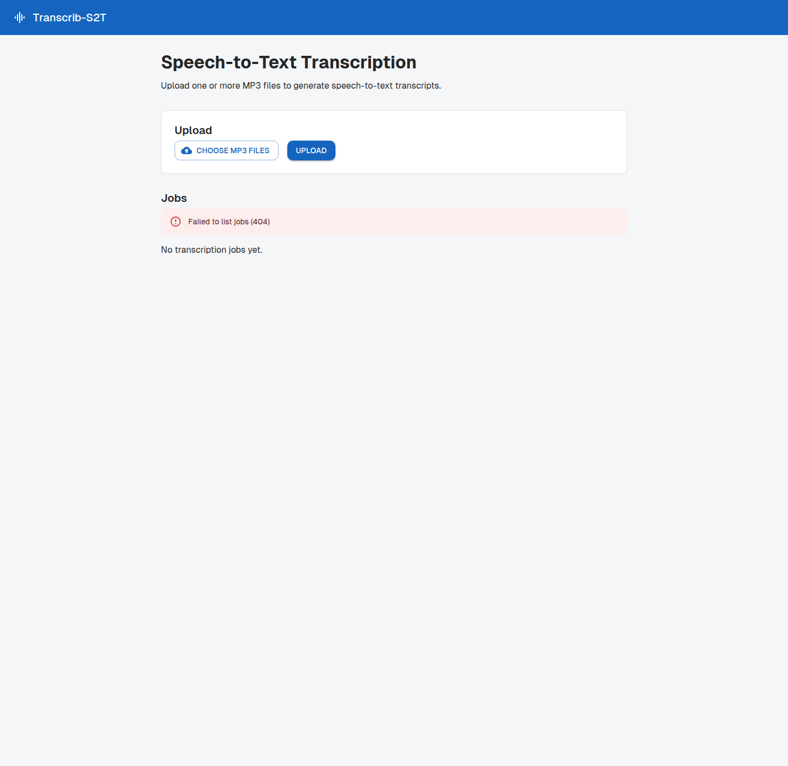

# Transcrib-S2T

Solution Azure **event-driven** de transcription de fichiers audio **MP3 → texte**
(Speech-to-Text avec *speaker diarization*).

Un utilisateur dépose un ou plusieurs MP3, un job de transcription est créé
automatiquement, le transcript est généré puis stocké, le statut est suivi, et
les fichiers de plus d'un jour sont purgés quotidiennement.

## Architecture

```
                    ┌─────────────┐
   Upload MP3  ───▶ │  Frontend   │  Next.js (App Router)
                    └──────┬──────┘
                           │ POST /jobs
                    ┌──────▼──────┐
                    │  Backend    │  C# / ASP.NET Core  ──▶  Azure Container Apps
                    │   API       │
                    └──┬───────┬──┘
          Blob "audio" │       │ Cosmos DB "jobs"
                  ┌────▼───┐   └────────────┐
                  │ Blob   │                │
                  │Storage │                │
                  └───┬────┘                │
   Blob trigger /     │ upload event        │  status updates
   When a blob added  │                     │
        ┌─────────────┴──────────────┐      │
        ▼                            ▼      │
  ┌───────────────┐          ┌───────────────┐
  │ Azure         │          │ Azure         │
  │ Functions     │   ==     │ Logic Apps    │   (deux approches équivalentes)
  │ (Pro Code)    │          │ (Low Code)    │
  └───────┬───────┘          └───────┬───────┘
          │   Azure AI Speech (diarization)  │
          └──────────────┬───────────────────┘
                         ▼
                 Blob "transcripts"  +  Cosmos "jobs" (Completed/Failed)

  ┌────────────────────────────────────────────┐
  │ Purge Logic App (daily) → supprime audio &  │
  │ transcripts > 1 jour, statut "Purged"       │
  └────────────────────────────────────────────┘
```

Les **deux approches** de transcription (Functions *Pro Code* et Logic Apps
*Low Code*) sont fonctionnellement équivalentes et partagent les mêmes contrats.

## Aperçu du frontend



Exemple affiché dans l'interface web :

- `reunion-client.mp3` → statut `Completed`, transcript téléchargeable
- `interview-produit.mp3` → statut `Processing`
- `point-support.mp3` → statut `Failed`

## Contrats partagés

- **Conteneurs Blob** : `audio` (sources MP3, nommées `{jobId}.mp3`),
  `transcripts` (résultats, `{jobId}.txt`).
- **Cosmos DB** — conteneur `jobs` (partition `/id`) :

  ```json
  {
    "id": "<jobId>",
    "fileName": "<nom.mp3>",
    "audioBlobUrl": "<url>",
    "transcriptBlobUrl": "<url|null>",
    "status": "Processing | Completed | Failed | Purged",
    "error": "<message|null>",
    "createdAt": "<ISO-8601>",
    "updatedAt": "<ISO-8601>"
  }
  ```

- **Secrets** : via **Key Vault** (clé Speech), accès inter-services par
  **Managed Identity**.
- **Observabilité** : logs et traces **Application Insights** pour chaque composant.

## Structure du dépôt

| Chemin | Contenu |
| --- | --- |
| `src/shared` | Bibliothèque C# partagée (modèle `TranscriptionJob`, repository Cosmos, accès Blob, validation MP3). |
| `src/api` | API C# (ASP.NET Core Minimal API) déployée sur Container Apps. |
| `src/functions` | Pipeline de transcription **Pro Code** (Azure Functions .NET isolated, blob trigger). |
| `src/logic-apps` | Workflows **Low Code** (Logic App Standard) : `transcription/` + `purge/`. |
| `src/frontend` | Application web **Next.js**. |
| `infra` | Infrastructure-as-Code **Bicep** + `main.parameters.json`. |
| `tests` | Tests unitaires xUnit (API + Functions). |
| `azure.yaml` | Configuration `azd` (déploiement de bout en bout). |

## API

| Méthode | Route | Description |
| --- | --- | --- |
| `POST` | `/jobs` | Upload d'un ou plusieurs MP3 (`multipart/form-data`), crée les jobs (`Processing`). |
| `GET` | `/jobs` | Liste des jobs. |
| `GET` | `/jobs/{id}` | Détail d'un job. |
| `GET` | `/jobs/{id}/transcript` | Téléchargement du transcript. |
| `DELETE` | `/jobs/{id}` | Suppression d'un job et de ses blobs (audio + transcript). |
| `PATCH` | `/internal/jobs/{id}/status` | Mise à jour de statut (utilisée par les Logic Apps). |

L'authentification **Entra ID** est activée automatiquement dès que la section
`AzureAd` (`ClientId`/`TenantId`) est configurée.

## Déploiement

Prérequis : [Azure Developer CLI (`azd`)](https://aka.ms/azd), .NET 10 SDK,
Node.js 24, Docker.

```bash
azd auth login
azd up
```

`azd up` provisionne l'infrastructure (Bicep) puis déploie l'API, les Functions,
les Logic Apps et le frontend. Variables optionnelles :

```bash
azd env set AZURE_AD_TENANT_ID <tenant-id>
azd env set AZURE_AD_CLIENT_ID <client-id>
azd env set SPEECH_LANGUAGE fr-FR
```

## Développement local

```bash
# Backend + Functions
dotnet build Transcrib.sln
dotnet test Transcrib.sln

# Frontend
cd src/frontend
npm install
npm run dev      # http://localhost:3000
npm test
```

Configurer `src/frontend/.env.local` avec `NEXT_PUBLIC_API_BASE_URL` pointant
vers l'API.

## Exemple de parcours utilisateur

1. Déposer un fichier MP3, par exemple `reunion-client.mp3`, depuis le frontend.
2. Le backend crée le job Cosmos DB avec le statut initial `Processing`.
3. Le pipeline Azure Functions ou Logic Apps génère le transcript puis dépose
   le résultat dans le conteneur Blob `transcripts`.
4. Dès que le statut passe à `Completed`, le frontend propose le téléchargement
   du transcript texte associé.

## Tests & CI

- **.NET** : xUnit (`tests/`) — validation MP3, création de job, transitions de
  statut, retry et chemin d'échec de la transcription.
- **Frontend** : Jest + React Testing Library (validation d'upload, rendu des
  statuts, lien de téléchargement).
- **CI** : `.github/workflows/ci.yml` construit et teste le .NET et le frontend,
  et valide les Bicep.
