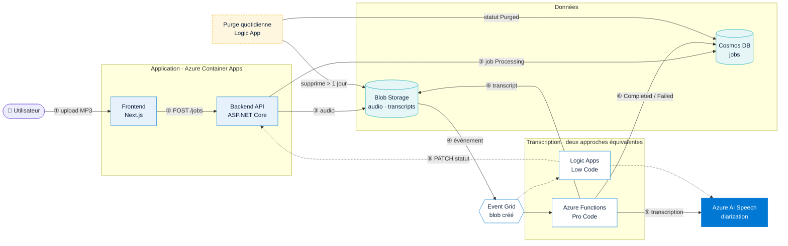

# Transcrib-S2T

Solution Azure **event-driven** de transcription de fichiers audio **MP3 → texte**
(Speech-to-Text avec *speaker diarization*).

Un utilisateur dépose un ou plusieurs MP3, un job de transcription est créé
automatiquement, le transcript est généré puis stocké, le statut est suivi, et
les fichiers de plus d'un jour sont purgés quotidiennement. Les transcripts
terminés peuvent ensuite être sélectionnés dans l'espace **Analyse qualité**
pour évaluer le discours, comparer jusqu'à cinq conversations et générer un
plan de coaching et des rapports exportables.

## Architecture


```mermaid
flowchart LR
    User(["👤 Utilisateur"])

    subgraph App["Application · Azure Container Apps"]
        FE["Frontend<br/>Next.js"]
        API["Backend API<br/>ASP.NET Core"]
    end

    subgraph Data["Données"]
        Blob[("Blob Storage<br/>audio · transcripts")]
        Cosmos[("Cosmos DB<br/>jobs")]
    end

    EG{{"Event Grid<br/>blob créé"}}

    subgraph Proc["Transcription · deux approches équivalentes"]
        Fn["Azure Functions<br/>Pro Code"]
        LA["Logic Apps<br/>Low Code"]
    end

    Speech["Azure AI Speech<br/>diarization"]
    Purge["Purge quotidienne<br/>Logic App"]

    User -->|"① upload MP3"| FE
    FE -->|"② POST /jobs"| API
    API -->|"③ audio"| Blob
    API -->|"③ job Processing"| Cosmos
    Blob -->|"④ événement"| EG
    EG --> Fn
    EG -.-> LA
    Fn -->|"⑤ transcription"| Speech
    LA -.-> Speech
    Fn -->|"⑥ transcript"| Blob
    Fn -->|"⑥ Completed / Failed"| Cosmos
    LA -.->|"⑥ PATCH statut"| API
    Purge -->|"supprime > 1 jour"| Blob
    Purge -->|"statut Purged"| Cosmos

    classDef app fill:#e7f1fb,stroke:#0078d4,color:#0b1f3a
    classDef data fill:#e6f6f7,stroke:#00a3ad,color:#0b1f3a
    classDef proc fill:#fff,stroke:#0078d4,color:#0b1f3a
    classDef ai fill:#0078d4,stroke:#0078d4,color:#fff
    classDef ops fill:#fff6e0,stroke:#f2a900,color:#0b1f3a,stroke-dasharray:4 3
    class FE,API app
    class Blob,Cosmos data
    class EG,Fn,LA proc
    class Speech ai
    class Purge ops
```

| Étape | Description |
| --- | --- |
| ① ② | L'utilisateur dépose un ou plusieurs MP3 ; le frontend appelle l'API. |
| ③ | L'API stocke l'audio (`audio/{jobId}.mp3`) et crée le job `Processing`. |
| ④ | Le dépôt du blob déclenche le pipeline de transcription. |
| ⑤ | Azure AI Speech transcrit avec identification des locuteurs. |
| ⑥ | Le transcript est écrit (`transcripts/{jobId}.txt`) et le job passe `Completed` (ou `Failed`). |
| 🗑️ | Chaque jour, audio et transcripts de plus d'un jour sont supprimés (statut `Purged`). |

Socle transverse : **Microsoft Entra ID** (SSO), **Managed Identity** entre
services (aucun secret), **Application Insights** (logs et traces).

Les **deux approches** de transcription (Functions *Pro Code* et Logic Apps
*Low Code*) sont fonctionnellement équivalentes et partagent les mêmes contrats.

> Documentation d'architecture détaillée : [docs/architecture.md](docs/architecture.md).
> Estimation des coûts (non-production / production sécurisée, transcription,
> hypothèse centre d'appel) : [docs/pricing.md](docs/pricing.md).
> Dossier projet (expression de besoins, solution, offre financière, plan
> projet estimatif) : [docs/dossier-projet.md](docs/dossier-projet.md), et sa
> présentation Marp : [docs/presentations/](docs/presentations/transcrib-s2t.md).
> Présentation en ligne (HTML) : [frkim.github.io/Transcrib-S2T](https://frkim.github.io/Transcrib-S2T/)
> — également en [PDF](https://frkim.github.io/Transcrib-S2T/transcrib-s2t.pdf)
> et [PPTX](https://frkim.github.io/Transcrib-S2T/transcrib-s2t.pptx).

## Contrats partagés

- **Conteneurs Blob** : `audio` (sources MP3, nommées `{jobId}.mp3`),
  `transcripts` (résultats, `{jobId}.txt`).
- **Cosmos DB** — conteneur `jobs` (partition `/id`) :

  ```json
  {
    "id": "<jobId>",
    "fileName": "<nom.mp3>",
    "audioBlobUrl": "<url>",
    "transcriptBlobUrl": "<url|null>",
    "status": "Processing | Completed | Failed | Purged",
    "error": "<message|null>",
    "createdAt": "<ISO-8601>",
    "updatedAt": "<ISO-8601>"
  }
  ```

- **Secrets** : aucun secret applicatif stocké — l'accès inter-services (Blob,
  Cosmos DB, Azure AI Speech) se fait entièrement par **Managed Identity** (Entra ID).
- **Observabilité** : logs et traces **Application Insights** pour chaque composant.

## Structure du dépôt

| Chemin | Contenu |
| --- | --- |
| `src/shared` | Bibliothèque C# partagée (modèle `TranscriptionJob`, repository Cosmos, accès Blob, validation MP3). |
| `src/api` | API C# (ASP.NET Core Minimal API) déployée sur Container Apps. |
| `src/functions` | Pipeline de transcription **Pro Code** (Azure Functions .NET isolated, blob trigger). |
| `src/logic-apps` | Workflows **Low Code** (Logic Apps *Consumption*) : `transcription/` + `purge/`. |
| `src/frontend` | Application web **Next.js** : upload, suivi, téléchargement et analyse qualitative V4.1 des transcripts. |
| `infra` | Infrastructure-as-Code **Bicep** + `main.parameters.json`. |
| `tests` | Tests unitaires xUnit (API + Functions). |
| `azure.yaml` | Configuration `azd` (déploiement de bout en bout). |

## API

| Méthode | Route | Description |
| --- | --- | --- |
| `POST` | `/jobs` | Upload d'un ou plusieurs MP3 (`multipart/form-data`), crée les jobs (`Processing`). |
| `GET` | `/jobs` | Liste des jobs. |
| `GET` | `/jobs/{id}` | Détail d'un job. |
| `GET` | `/jobs/{id}/transcript` | Téléchargement du transcript. |
| `DELETE` | `/jobs/{id}` | Suppression d'un job et de ses blobs (audio + transcript). |
| `PATCH` | `/internal/jobs/{id}/status` | Mise à jour de statut (utilisée par les Logic Apps). |

L'authentification **Entra ID** est activée automatiquement dès que la section
`AzureAd` (`ClientId`/`TenantId`) est configurée.

### Limites d'utilisation

Le endpoint `POST /jobs` applique des quotas (configurables via la section
`TranscriptionLimits` de `appsettings.json`) :

| Limite | Valeur par défaut | Clé de configuration |
| --- | --- | --- |
| Transcriptions par jour | 3 | `MaxPerDay` |
| Transcriptions par semaine | 10 | `MaxPerWeek` |
| Durée maximale par fichier | 5 minutes | `MaxDurationMinutes` |

Les quotas sont appliqués globalement sur des fenêtres glissantes (24 h et 7 j)
à partir de la date de création des jobs. Un fichier dépassant la durée maximale
est rejeté avec sa raison ; lorsqu'un quota est atteint et qu'aucun job n'est
créé, l'API répond `429 Too Many Requests`. Dans tous les cas, le corps de la
réponse contient la liste `rejected` (`fileName`, `reason`).

## Déploiement

Prérequis : [Azure Developer CLI (`azd`)](https://aka.ms/azd), .NET 10 SDK,
Node.js 24, Docker.

```bash
azd auth login
azd env new <nom-environnement> --location francecentral
azd up
```

Région par défaut : **France Central** (`francecentral`). En cas
d'indisponibilité d'un service ou d'un quota, utiliser **Sweden Central**
(`swedencentral`), puis **North Europe** (`northeurope`) — voir
[docs/pricing.md](docs/pricing.md#région-de-déploiement).

`azd up` provisionne l'infrastructure (Bicep) puis déploie l'API, les Functions,
les Logic Apps et le frontend. Variables optionnelles :

```bash
azd env set AZURE_AD_TENANT_ID <tenant-id>
azd env set AZURE_AD_CLIENT_ID <client-id>
azd env set SPEECH_LANGUAGE fr-FR
```

## Développement local

```bash
# Backend + Functions
dotnet build Transcrib.sln
dotnet test Transcrib.sln

# Frontend
cd src/frontend
npm install
npm run dev      # http://localhost:3000
npm test
```

Configurer `src/frontend/.env.local` avec `NEXT_PUBLIC_API_BASE_URL` pointant
vers l'API.

## Exemple de parcours utilisateur

1. Déposer un fichier MP3, par exemple `reunion-client.mp3`, depuis le frontend.
2. Le backend crée le job Cosmos DB avec le statut initial `Processing`.
3. Le pipeline Azure Functions ou Logic Apps génère le transcript puis dépose
   le résultat dans le conteneur Blob `transcripts`.
4. Dès que le statut passe à `Completed`, le frontend propose le téléchargement
   du transcript texte associé.

## Tests & CI

- **.NET** : xUnit (`tests/`) — validation MP3, création de job, transitions de
  statut, retry et chemin d'échec de la transcription.
- **Frontend** : Jest + React Testing Library (validation d'upload, rendu des
  statuts, lien de téléchargement).
- **CI** : `.github/workflows/ci.yml` construit et teste le .NET et le frontend,
  et valide les Bicep.
- **Présentation** : `.github/workflows/presentation.yml` génère la présentation
  Marp (HTML, PDF, PPTX) à chaque modification de `docs/presentations/` et la
  publie en artefact `transcrib-s2t-presentation`. Sur `main` (push ou
  déclenchement manuel), la version HTML est aussi déployée sur **GitHub Pages**
  ([frkim.github.io/Transcrib-S2T](https://frkim.github.io/Transcrib-S2T/), PDF et PPTX téléchargeables via
  `transcrib-s2t.pdf` / `transcrib-s2t.pptx`). Prérequis unique : *Settings →
  Pages → Source : GitHub Actions*. En local :

  ```bash
  cd docs/presentations
  npm ci
  npm run build    # dist/transcrib-s2t.{html,pdf,pptx} (Google Chrome requis)
  ```
