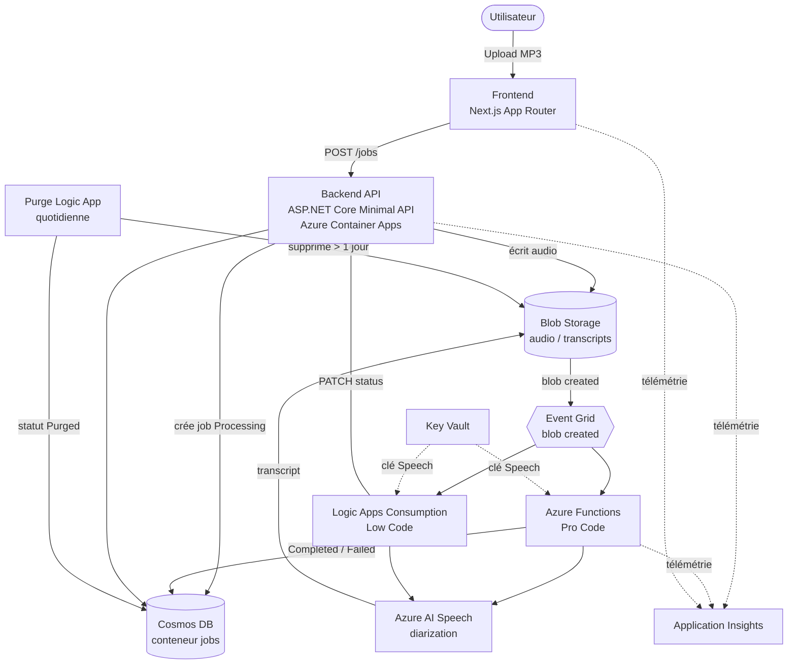
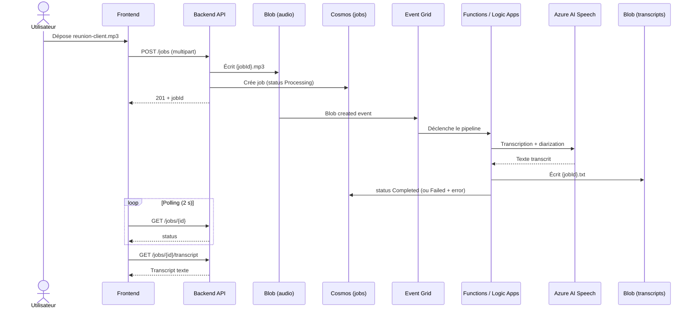
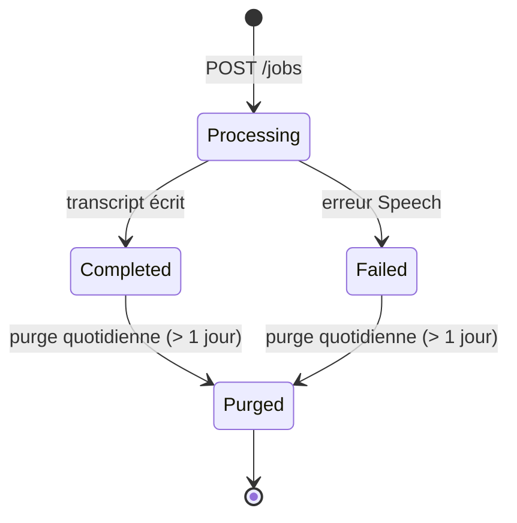

# Architecture — Transcrib-S2T

Transcrib-S2T est une solution Azure **event-driven** de transcription de fichiers
audio **MP3 → texte** (Speech-to-Text avec *speaker diarization*). Ce document
décrit l'architecture technique, les composants, les flux de données et les
choix de conception.

## Vue d'ensemble

Un utilisateur dépose un ou plusieurs fichiers MP3 depuis le frontend. Le
backend crée un *job* de transcription et stocke l'audio. Le dépôt du blob
déclenche automatiquement un pipeline de transcription (Azure Functions **ou**
Logic Apps) qui appelle Azure AI Speech, écrit le transcript et met à jour le
statut du job. Une purge quotidienne supprime les fichiers de plus d'un jour.



> Les **deux approches** de transcription (Functions *Pro Code* et Logic Apps
> *Low Code*) sont fonctionnellement équivalentes et partagent les mêmes
> contrats. En production, la transcription réelle est assurée par l'Azure
> Function déclenchée par Event Grid ; le workflow Logic App est l'alternative
> low-code.

## Composants

| Composant | Technologie | Hébergement | Rôle |
| --- | --- | --- | --- |
| Frontend | Next.js (App Router), React | Azure Container Apps | Upload MP3 (single + multi), suivi des jobs, téléchargement des transcripts. |
| Backend API | C# / ASP.NET Core Minimal API | Azure Container Apps | Réception des uploads, création/consultation des jobs, exposition des transcripts. |
| Bibliothèque partagée | C# (`src/shared`) | — | Modèle `TranscriptionJob`, repository Cosmos, accès Blob, validation MP3. |
| Pipeline Pro Code | Azure Functions .NET isolated | Azure Functions (Consumption) | Transcription déclenchée par Event Grid sur dépôt de blob. |
| Pipeline Low Code | Logic Apps (Consumption) | PaaS (pay-per-action) | Alternative low-code : workflows `transcription` + `purge`. |
| Speech-to-Text | Azure AI Speech | PaaS | Transcription avec *speaker diarization*. |
| Stockage audio/transcripts | Azure Blob Storage | PaaS | Conteneurs `audio` et `transcripts`. |
| Métadonnées jobs | Azure Cosmos DB | PaaS | Conteneur `jobs` (partition `/id`). |
| Routage d'événements | Azure Event Grid | PaaS | Notification « blob créé » vers Functions / Logic Apps. |
| Secrets | Azure Key Vault | PaaS | Clé Azure AI Speech, accès inter-services par Managed Identity. |
| Observabilité | Application Insights | PaaS | Logs et traces pour chaque composant. |

## Services Azure (inventaire complet)

Ensemble des services Azure effectivement provisionnés (préfixes de nommage
entre parenthèses) et leur rôle.

| Service Azure | Ressource | Rôle |
| --- | --- | --- |
| Azure Container Apps — Environment | `cae-` | Hôte serverless conteneurisé mutualisé (frontend + API), intégré à Log Analytics. |
| Azure Container Apps — App frontend | `ca-web-` | Application web Next.js (upload, suivi, téléchargement). Scale-to-zero. |
| Azure Container Apps — App API | `ca-api-` | API C# ASP.NET Core (jobs, transcripts). Scale-to-zero. |
| Azure Functions (Consumption, Y1) | `plan-func-` + `func-` | Pipeline **Pro Code** de transcription, déclenché par Event Grid. |
| Azure Logic Apps (Consumption) — transcription | `logic-transcription-` | Pipeline **Low Code** équivalent (HTTP + Managed Identity). |
| Azure Logic Apps (Consumption) — purge | `logic-purge-` | Purge quotidienne des blobs > 1 jour et mise à jour du statut. |
| Azure AI Speech (Cognitive Services, S0) | `speech-` | Transcription **Fast Transcription** + *speaker diarization*. |
| Azure Blob Storage — données | `st…` | Conteneurs `audio`, `transcripts`, `transcripts-auto`. |
| Azure Blob Storage — Functions | `stfunc…` | Stockage de déploiement et d'état du runtime Functions. |
| Azure Cosmos DB (serverless) | `cosmos-` | Métadonnées des jobs (conteneur `jobs`, partition `/id`). |
| Azure Event Grid (system topic) | `evgt-` | Routage de l'événement « blob créé » vers la Function. |
| Azure Key Vault | `kv-` | Secrets (clé Azure AI Speech). |
| Azure Container Registry (Basic) | `acr…` | Images conteneurs de l'API et du frontend. |
| Application Insights | `appi-` | APM, traces distribuées, diagnostic. |
| Log Analytics Workspace | `log-` | Backend de logs (Container Apps, App Insights). |
| User-assigned Managed Identity | `id-` | Identité unique inter-services (accès RBAC Blob, Cosmos, Key Vault, Speech). |

## Choix du service Azure Speech

Le projet utilise l'**API Fast Transcription** d'Azure AI Speech, appelée en REST :
`POST {speechEndpoint}/speechtotext/transcriptions:transcribe?api-version=2024-11-15`,
avec **diarization** activée (`maxSpeakers = 10`).

### Options envisagées

| Option | Mode | Retenu ? |
| --- | --- | --- |
| **Fast Transcription** | REST **synchrone**, plus rapide que le temps réel | ✅ |
| Batch Transcription | Asynchrone (soumission + *polling*, URLs de blob) | ❌ surdimensionné, latence et orchestration inutiles |
| Speech SDK temps réel | Streaming continu | ❌ nécessite un décodage audio local (GStreamer) pour le MP3 |

### Pourquoi Fast Transcription

1. **Latence faible et prévisible** — réponse en un seul appel HTTP synchrone,
   idéal pour des fichiers courts à moyens (< 2 h / < 300 Mo), sans machinerie
   de *polling*.
2. **Décodage audio côté serveur** — l'API accepte directement le MP3 (et WAV,
   FLAC, OGG…) ; aucun codec/GStreamer à installer sur l'hôte Functions ou
   Logic Apps.
3. **Diarization intégrée** — chaque phrase est attribuée à un locuteur
   (`speaker`), sans service tiers.
4. **Intégration simple** — un appel `multipart/form-data` (partie `audio` +
   partie `definition` JSON), utilisable à l'identique en C# (Function) et via
   une action HTTP Logic App.
5. **Cohérence Pro Code / Low Code** — la même API REST est invoquée par la
   Function et par le workflow Logic App, garantissant des résultats équivalents.

> Authentification de l'appel Speech : par **clé** côté Function (clé lue depuis
> Key Vault, en-tête `Ocp-Apim-Subscription-Key`) et par **Managed Identity**
> côté Logic App (audience `https://cognitiveservices.azure.com`).

## Flux de transcription



### Étapes

1. L'utilisateur dépose un MP3 depuis le frontend.
2. Le backend valide le fichier, écrit l'audio dans le conteneur Blob `audio`
   (`{jobId}.mp3`) et crée le job Cosmos DB avec le statut initial `Processing`.
3. Le dépôt du blob émet un événement Event Grid consommé par l'Azure Function
   (ou le workflow Logic App).
4. Le pipeline appelle Azure AI Speech (avec diarization), écrit le résultat dans
   le conteneur `transcripts` (`{jobId}.txt`) et met à jour le statut du job en
   `Completed` (ou `Failed` avec un message d'erreur).
5. Le frontend, qui interroge l'API périodiquement, propose le téléchargement du
   transcript dès que le statut passe à `Completed`.

## Cycle de vie et purge



Une **Logic App de purge** planifiée (quotidienne) supprime les fichiers audio
et transcripts de plus d'un jour et bascule le statut des jobs concernés vers
`Purged`.

## Contrats partagés

### Conteneurs Blob

- `audio` : sources MP3, nommées `{jobId}.mp3`.
- `transcripts` : résultats, nommés `{jobId}.txt`.

### Modèle Cosmos DB (`jobs`, partition `/id`)

```json
{
  "id": "<jobId>",
  "fileName": "<nom.mp3>",
  "audioBlobUrl": "<url>",
  "transcriptBlobUrl": "<url|null>",
  "status": "Processing | Completed | Failed | Purged",
  "error": "<message|null>",
  "createdAt": "<ISO-8601>",
  "updatedAt": "<ISO-8601>"
}
```

### API HTTP

| Méthode | Route | Description |
| --- | --- | --- |
| `POST` | `/jobs` | Upload d'un ou plusieurs MP3 (`multipart/form-data`), crée les jobs (`Processing`). |
| `GET` | `/jobs` | Liste des jobs. |
| `GET` | `/jobs/{id}` | Détail d'un job. |
| `GET` | `/jobs/{id}/transcript` | Téléchargement du transcript. |
| `DELETE` | `/jobs/{id}` | Suppression d'un job et de ses blobs (audio + transcript). |
| `PATCH` | `/internal/jobs/{id}/status` | Mise à jour de statut (utilisée par les Logic Apps). |

## Sécurité et identité

- **Managed Identity** : les services communiquent entre eux (Blob, Cosmos DB,
  Key Vault, Speech) via des identités managées, sans secret en clair.
- **Key Vault** : la clé Azure AI Speech est stockée dans Key Vault et lue par
  les pipelines de transcription.
- **Entra ID** : l'authentification du frontend et de l'API est activée
  automatiquement dès que la section `AzureAd` (`ClientId` / `TenantId`) est
  configurée.

## Observabilité

Chaque composant (frontend, API, Functions) émet logs et traces vers
**Application Insights**, ce qui permet le suivi de bout en bout d'un job, la
mesure du temps de traitement (`updatedAt − createdAt`) et le diagnostic des
échecs.

## Infrastructure et déploiement

L'infrastructure est décrite en **Bicep** (`infra/`), organisée en modules par
ressource (storage, cosmos, speech, keyvault, functions, logicapps, api,
frontend, eventgrid, monitoring, identity, registry, containerAppsEnv). Le
déploiement de bout en bout est orchestré par **Azure Developer CLI** (`azd`) :

```bash
azd auth login
azd up
```

`azd up` provisionne l'infrastructure puis déploie l'API, les Functions, les
Logic Apps et le frontend.

> Note d'exploitation : lors d'une recréation à neuf, la souscription Event
> Grid nécessite que le code de la Function soit déjà déployé (le webhook du
> déclencheur blob doit exister). Exécuter `azd deploy functions` avant
> `azd provision` pour éviter l'échec de validation du webhook.

## Coût approximatif (France Central)

Estimations **indicatives** en USD/mois pour un déploiement en **France Central**
avec un usage de type démonstration/léger, **après optimisations** (Logic Apps
en Consumption, Container Apps en scale-to-zero, Microsoft Defender for Cloud
désactivé). Les prix France Central sont comparables à Sweden Central (certains
services légèrement supérieurs).

| Service | Base de facturation | Coût approx. (USD/mois) |
| --- | --- | ---: |
| Azure Container Registry (Basic) | Forfait fixe | ~5 |
| Log Analytics + Application Insights | Par Go ingéré | ~1–3 |
| Azure AI Speech (S0, Fast transcription) | Par heure d'audio (~1 $/h) | variable (~1–5) |
| Azure Container Apps (scale-to-zero) | vCPU-s / GiB-s (crédit gratuit mensuel) | ~0–3 |
| Azure Functions (Consumption) | Exécutions + GB-s | ~0–2 |
| Azure Logic Apps (Consumption) | Par action exécutée | ~0–1 |
| Azure Cosmos DB (serverless) | Par RU consommée | ~0–1 |
| Azure Blob Storage (LRS, 2 comptes) | Go stockés + opérations | ~0,5–1 |
| Azure Event Grid | Par opération (100 k gratuites/mois) | ~0 |
| Azure Key Vault | Par transaction | ~0 |
| User-assigned Managed Identity | — | Gratuit |
| **Total estimé** | | **~8–20 USD/mois** |

> Le poste dominant à faible charge est le **Container Registry Basic** (forfait
> fixe ~5 $). Le coût **Speech** croît avec le volume audio transcrit.
>
> À titre de comparaison, **sans** les optimisations (plan Logic App Standard
> WS1 toujours actif + Container Apps `minReplicas=1` + Defender activé), le
> total observé était de l'ordre de **~60–75 USD/mois**.

## Références

- Vue d'ensemble et guide de démarrage : [../README.md](../README.md).
