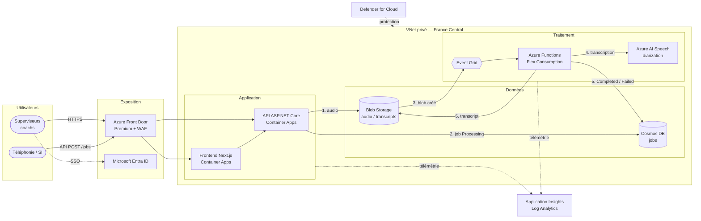
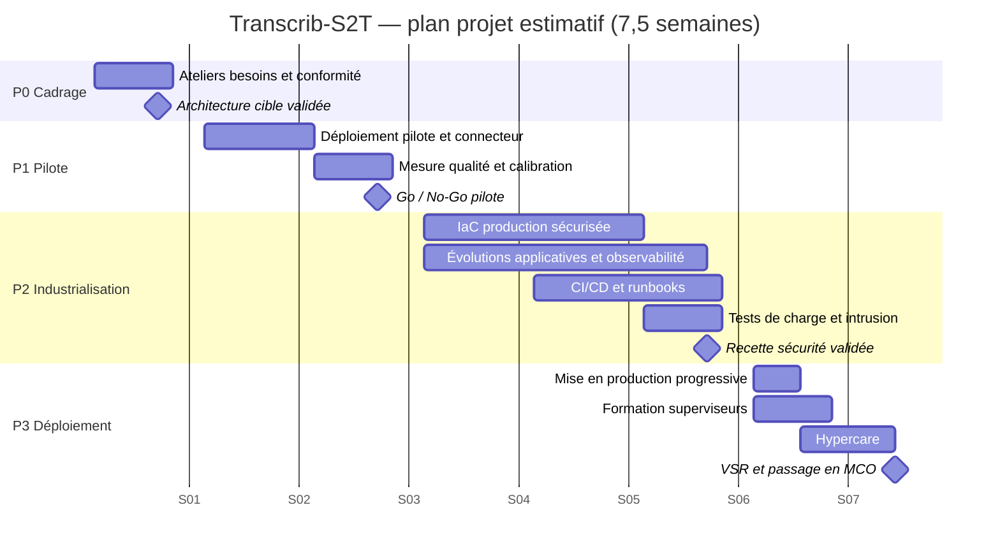
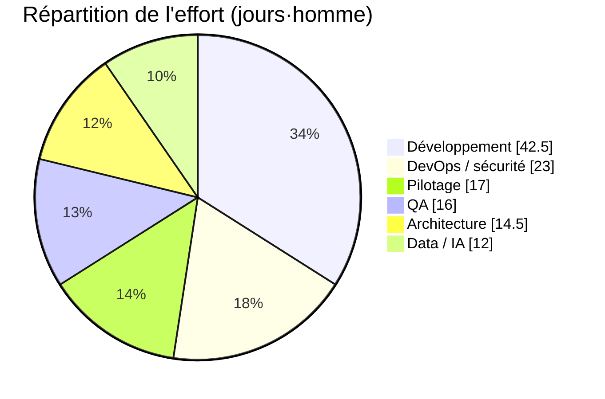

# Dossier projet — Transcrib-S2T

Proposition de solution, offre financière et plan projet estimatif pour
l'industrialisation de **Transcrib-S2T** : la transcription automatique
(MP3 → texte, avec identification des locuteurs) et l'analyse qualitative des
conversations clients sur Azure.

> 📽️ **Présentation associée** (14 slides) :
> [`presentations/transcrib-s2t.md`](presentations/transcrib-s2t.md) — générée
> en HTML, PDF et PPTX par le workflow
> [`presentation.yml`](../.github/workflows/presentation.yml).
>
> ⚠️ Les montants sont **indicatifs** (hors taxes, hors frais de déplacement).
> Les coûts Azure reprennent [pricing.md](pricing.md) (€ HT, *pay-as-you-go*,
> région France Central par défaut ; alternatives Sweden Central puis North
> Europe). Ils sont à confirmer à l'issue du cadrage.

## Sommaire

1. [Synthèse](#1-synthèse)
2. [Expression de besoins](#2-expression-de-besoins)
3. [Solution technologique](#3-solution-technologique)
4. [Sécurité et conformité](#4-sécurité-et-conformité)
5. [Démarche et plan projet estimatif](#5-démarche-et-plan-projet-estimatif)
6. [Organisation et gouvernance](#6-organisation-et-gouvernance)
7. [Offre financière](#7-offre-financière)
8. [Valeur et retour sur investissement](#8-valeur-et-retour-sur-investissement)
9. [Risques et mitigations](#9-risques-et-mitigations)
10. [Hypothèses et conditions](#10-hypothèses-et-conditions)
11. [Prochaines étapes](#11-prochaines-étapes)

## 1. Synthèse

| Thème | En bref |
| --- | --- |
| **Problème** | Les équipes qualité n'écoutent qu'une faible part des appels (typiquement 1 à 2 %), à la main, avec ~15 minutes par évaluation. Les signaux faibles (insatisfaction, non-conformité, risque de churn) passent inaperçus. |
| **Solution** | Une plateforme Azure *event-driven* qui transcrit automatiquement chaque enregistrement (avec *speaker diarization*), suit le traitement de bout en bout, puis outille l'analyse qualitative et le coaching des conseillers. |
| **Atout** | Un **accélérateur déjà opérationnel** (ce dépôt) : API, pipeline de transcription, frontend, analyse qualité V4.1, IaC Bicep et CI. Le projet porte sur l'**industrialisation**, pas sur une page blanche. |
| **Délai** | **7,5 semaines** de la notification à la fin de l'hypercare, avec un pilote démontrable en **semaine 3**. |
| **Investissement** | **114 725 € HT** au forfait (125 jours·homme), payable par jalons. |
| **Run** | De **~9 €/mois** (non-production) à **~600–920 €/mois** hors Speech (production sécurisée) ; Speech facturé à l'usage (~0,92 €/h d'audio, ~0,17 €/h en Batch). |
| **Valeur** | Couverture qualité portée de 1 % à **100 % des appels**, et ~**8 300 heures** de superviseur libérées par an dans l'hypothèse centre d'appel (retour sur investissement estimé à **~7–8 mois**). |

## 2. Expression de besoins

### 2.1 Contexte et objectifs

Le client exploite un service de relation client à fort volume d'appels
enregistrés. Il souhaite exploiter ces enregistrements pour piloter la qualité
de service et accompagner la montée en compétence des conseillers.

| # | Objectif métier | Indicateur de succès (cible à confirmer au pilote) |
| --- | --- | --- |
| O1 | Couvrir l'ensemble des conversations, et non un échantillon | ≥ 95 % des enregistrements transcrits sous 24 h |
| O2 | Réduire le temps d'évaluation d'une conversation | De ~15 min à ~5 min par évaluation |
| O3 | Objectiver le coaching des conseillers | Plan de coaching généré pour 100 % des conversations analysées |
| O4 | Protéger les données personnelles | 0 audio ni transcript conservé au-delà de 24 h |
| O5 | Maîtriser les coûts | Coût complet ≤ 0,11 € par appel de 7 min (≤ 0,03 € en Batch) |

### 2.2 Acteurs

| Acteur | Attentes principales |
| --- | --- |
| Superviseur / responsable qualité | Déposer des enregistrements, suivre les traitements, analyser et comparer des conversations. |
| Coach / formateur | Disposer de preuves (extraits) et d'un plan de coaching exploitable. |
| Plateforme de téléphonie / SI | Pousser automatiquement les enregistrements via API, sans intervention humaine. |
| Exploitation (Ops) | Déployer, superviser et diagnostiquer la plateforme. |
| DPO / RSSI | Garantir la conformité RGPD, la traçabilité et la sécurité des accès. |

### 2.3 Exigences fonctionnelles

| ID | Exigence | Priorité | Couverture par l'accélérateur |
| --- | --- | --- | --- |
| EF-01 | Déposer un ou plusieurs fichiers MP3 depuis l'interface web | Must | ✅ Disponible |
| EF-02 | Ingérer automatiquement les enregistrements depuis la téléphonie (API) | Must | 🟡 API `POST /jobs` disponible, connecteur à réaliser |
| EF-03 | Transcrire avec horodatage et identification des locuteurs | Must | ✅ Disponible (Fast Transcription + diarization) |
| EF-04 | Suivre le statut des traitements (`Processing`, `Completed`, `Failed`, `Purged`) | Must | ✅ Disponible |
| EF-05 | Télécharger le transcript | Must | ✅ Disponible |
| EF-06 | Analyser la qualité (7 étapes pondérées, signaux sensibles, comparaison jusqu'à 5 conversations, coaching 90 jours, exports) | Must | ✅ Disponible (V4.1, dans le navigateur) |
| EF-07 | Supprimer un traitement et ses fichiers à la demande | Should | ✅ Disponible |
| EF-08 | Purger automatiquement les fichiers au-delà de 24 h | Must | ✅ Disponible |
| EF-09 | Paramétrer des quotas d'usage (jour, semaine, durée max.) | Should | ✅ Disponible |
| EF-10 | Traiter en différé de gros volumes à moindre coût (Batch) | Could | 🟡 Option A |
| EF-11 | Enrichir l'analyse par IA générative (synthèse, détection d'intentions) | Could | 🟡 Option B |

### 2.4 Exigences non fonctionnelles

| ID | Domaine | Exigence |
| --- | --- | --- |
| ENF-01 | Sécurité | Authentification Entra ID (SSO) ; accès inter-services par **Managed Identity**, aucun secret applicatif. |
| ENF-02 | Réseau | En production : Private Endpoints, accès public désactivé sur les données, exposition via WAF. |
| ENF-03 | Conformité | Hébergement **France Central** (à défaut, après validation DPO / RSSI : Sweden Central, puis North Europe — UE) ; purge à J+1 ; journalisation des accès. |
| ENF-04 | Performance | Transcription d'un appel de 7 min en moins de 2 min (Fast Transcription) ; pointe de ~35 traitements/min. |
| ENF-05 | Disponibilité | 99,9 % en production (zone redundancy Container Apps, stockage ZRS). |
| ENF-06 | Scalabilité | Services *serverless* et *scale-to-zero* : coût proportionnel à l'usage. |
| ENF-07 | Observabilité | Logs, métriques et traces distribuées dans Application Insights pour chaque composant. |
| ENF-08 | Exploitabilité | Infrastructure as Code (Bicep + `azd`), CI/CD GitHub Actions, *runbooks*. |
| ENF-09 | Accessibilité | Interface conforme WCAG 2.1 AA, thème clair/sombre. |
| ENF-10 | Coûts | Budgets et alertes Azure Cost Management par environnement ; quotas d'usage applicatifs. |

### 2.5 Hors périmètre

- Transcription en temps réel (*streaming* pendant l'appel).
- Traduction automatique des transcripts.
- Intégration CRM / WFM (chiffrable en option après cadrage).
- Modèle Custom Speech (vocabulaire métier dédié), sauf si le pilote le justifie.
- Plan de reprise multi-région.

## 3. Solution technologique

### 3.1 Architecture cible (production sécurisée)

La solution reprend l'architecture de l'accélérateur
([architecture.md](architecture.md)) et la durcit pour la production.

### 3.2 Choix technologiques

| Brique | Choix | Justification | Alternative écartée |
| --- | --- | --- | --- |
| Frontend | Next.js (App Router) sur Container Apps | Standard du client, rendu serveur, analyse locale dans le navigateur. | SPA statique : pas de proxy API ni de rendu serveur. |
| API | ASP.NET Core Minimal API sur Container Apps | Performances, typage fort, scale-to-zero, déploiement conteneur. | App Service : coût fixe plus élevé à faible charge. |
| Transcription | Azure AI Speech — **Fast Transcription** | Synchrone, décodage MP3 côté service, diarization incluse, ~0,92 €/h. | Speech SDK temps réel : décodage local (GStreamer) nécessaire. |
| Gros volumes | Azure AI Speech — **Batch** (option A) | ~0,17 €/h, soit −80 % sur le poste principal. | Engagement Fast seul : économie limitée à ~−50 %. |
| Orchestration | **Azure Functions** (*Pro Code*) déclenchées par Event Grid | Intégration VNet, testabilité, coût marginal à fort volume. | Logic Apps Consumption : incompatibles avec les Private Endpoints (conservées pour la non-production). |
| Données | Blob Storage + Cosmos DB serverless | Stockage éphémère (purge J+1), métadonnées à la demande. | Azure SQL : schéma et coût fixe superflus. |
| Identité | Entra ID + Managed Identity | Zéro secret, RBAC fin, SSO. | Clés d'accès / chaînes de connexion. |
| IA générative | Microsoft Foundry (option B) | Plateforme IA Microsoft de référence, Responses API, hébergement UE. | Appels directs à un modèle tiers hors Azure. |
| IaC / CI | Bicep + `azd`, GitHub Actions (OIDC) | Reproductibilité, environnements jetables, aucun secret de déploiement. | Scripts manuels, Terraform (non standard client). |

> Les deux approches *Pro Code* (Functions) et *Low Code* (Logic Apps) de
> l'accélérateur partagent les mêmes contrats. La production retient
> **Functions** (intégration réseau privée, coût à fort volume) ; Logic Apps
> restent une option pour les environnements de démonstration.

### 3.3 Ce qui est réutilisé, ce qui est construit

| Réutilisé de l'accélérateur | Construit pendant le projet |
| --- | --- |
| API jobs, quotas, suppression, contrats Blob / Cosmos | Connecteur d'ingestion téléphonie (lots, reprise sur erreur) |
| Pipeline Functions + Logic Apps, purge J+1 | Variante IaC **production sécurisée** (VNet, Private Endpoints, Front Door, Defender) |
| Frontend upload / suivi / téléchargement | Calibration de l'analyse qualité sur les grilles du client |
| Analyse qualitative V4.1 et exports | Tableaux de bord d'exploitation, alertes, *runbooks* |
| IaC Bicep non-production, CI build & tests | Tests de charge, test d'intrusion, pipeline de déploiement multi-environnements |

## 4. Sécurité et conformité

| Domaine | Mesures |
| --- | --- |
| Identité et accès | SSO Entra ID, rôles applicatifs, Managed Identity entre services, aucun secret stocké. |
| Réseau | VNet dédié, Private Endpoints (Blob, Cosmos DB, Speech, ACR, Key Vault), NAT Gateway, Front Door Premium + WAF (règles OWASP, *bot protection*). |
| Données | Hébergement France Central, chiffrement au repos et en transit, **purge automatique à J+1**, suppression à la demande, analyse qualité exécutée dans le navigateur (aucune donnée envoyée à un service tiers). |
| Détection | Microsoft Defender for Cloud (Storage, Containers, Key Vault, Cosmos DB), journaux WAF, alertes Application Insights. |
| RGPD | Registre de traitement et AIPD accompagnés par le projet (avec le DPO), information des personnes enregistrées, minimisation et durée de conservation de 24 h. |

## 5. Démarche et plan projet estimatif

### 5.1 Démarche

Une démarche **agile par paliers de valeur**, en sprints d'une semaine avec
démonstration systématique, et un **Go/No-Go** à l'issue du pilote pour
sécuriser l'investissement. Le planning est volontairement resserré : les profils
interviennent en parallèle (équipe d'environ 4 ETP au pic, en industrialisation).

| Phase | Durée | Objectif | Livrables clés |
| --- | --- | --- | --- |
| **P0 — Cadrage** | S1 | Aligner besoins, architecture et conformité | Note de cadrage, architecture validée, backlog priorisé, AIPD initiée |
| **P1 — Pilote** | S2–S3 | Prouver la valeur sur données réelles | Environnement pilote, connecteur d'ingestion, mesure de qualité (WER, diarization), grille qualité calibrée, rapport Go/No-Go |
| **P2 — Industrialisation** | S4–S6 | Rendre la solution sûre, robuste et exploitable | IaC production sécurisée, CI/CD multi-environnements, observabilité, tests de charge, test d'intrusion, *runbooks* |
| **P3 — Déploiement et adoption** | S7–mi-S8 | Mettre en service et ancrer les usages | Mise en production progressive, formation des superviseurs, hypercare d'une semaine, VSR |
| **Run — MCO** | À partir de S9 | Maintenir et faire évoluer | Support, maintenance corrective et évolutive, revue mensuelle des coûts |

### 5.2 Planning

Planning établi pour un démarrage (T0) le lundi 4 janvier 2027, à recaler à la
date de notification.

### 5.3 Jalons

| Jalon | Semaine | Critère de passage |
| --- | --- | --- |
| J0 — Lancement | S1 | Équipes nommées, accès Azure et données d'échantillon disponibles |
| J1 — Architecture validée | Fin S1 | Note de cadrage et architecture signées (métier, RSSI, DPO) |
| J2 — Go/No-Go pilote | Fin S3 | Indicateurs O1–O3 atteints sur l'échantillon, coûts unitaires confirmés |
| J3 — Recette sécurité | Fin S6 | Tests de charge (pointe ×2) et test d'intrusion sans vulnérabilité critique |
| J4 — Mise en production | S7 | Bascule progressive validée par le COPIL |
| J5 — VSR | Mi-S8 | Vérification de service régulier prononcée, passage en MCO |

## 6. Organisation et gouvernance

### 6.1 Équipe projet

| Profil | Rôle | Charge (j·h) |
| --- | --- | ---: |
| Directeur / chef de projet | Pilotage, planning, risques, comitologie | 17 |
| Architecte cloud Azure | Architecture cible, sécurité, revue de conception | 14,5 |
| Développeur(s) senior .NET / Next.js | Connecteur, évolutions API et frontend, tests | 42,5 |
| Ingénieur DevOps / sécurité | IaC production, CI/CD, réseau privé, observabilité | 23 |
| Ingénieur QA | Stratégie de test, recette, tests de charge | 16 |
| Consultant data / IA | Mesure de qualité de transcription, calibration de la grille qualité | 12 |
| **Total** | | **125** |

### 6.2 Comitologie

| Instance | Fréquence | Participants | Objet |
| --- | --- | --- | --- |
| COPIL | Mensuel + jalons | Sponsor, direction relation client, DSI, RSSI, DPO, directeur de projet | Arbitrages, budget, Go/No-Go |
| COPROJ | Hebdomadaire | Chef de projet, *product owner*, architecte | Avancement, risques, priorités |
| Revue de sprint | Hebdomadaire | Équipe, *product owner*, utilisateurs clés | Démonstration et validation |

### 6.3 RACI simplifié

| Activité | Client (PO / métier) | Client (DSI / RSSI / DPO) | Équipe projet |
| --- | --- | --- | --- |
| Expression et priorisation des besoins | **A** / R | C | C |
| Architecture et sécurité | I | **A** | R |
| Réalisation et tests | C | I | **A** / R |
| Recette métier | **A** / R | I | C |
| Conformité RGPD (AIPD) | C | **A** / R | C |
| Mise en production | I | **A** | R |

## 7. Offre financière

### 7.1 Taux journaliers

| Profil | TJM (€ HT) |
| --- | ---: |
| Directeur / chef de projet | 950 |
| Architecte cloud Azure | 1 200 |
| Développeur senior | 850 |
| Ingénieur DevOps / sécurité | 950 |
| Ingénieur QA | 700 |
| Consultant data / IA | 1 000 |

### 7.2 Build — forfait par phase

| Phase | Charge (j·h) | Montant (€ HT) |
| --- | ---: | ---: |
| P0 — Cadrage | 10 | 10 600 |
| P1 — Pilote | 35 | 31 750 |
| P2 — Industrialisation | 61,5 | 55 575 |
| P3 — Déploiement et adoption | 18,5 | 16 800 |
| **Total forfait** | **125** | **114 725** |

Détail de la charge par phase et par profil (j·h) :

| Phase | Chef de projet | Architecte | Développeur | DevOps | QA | Data / IA |
| --- | ---: | ---: | ---: | ---: | ---: | ---: |
| P0 | 3 | 4 | 0 | 1 | 0 | 2 |
| P1 | 4 | 3 | 15 | 4 | 4 | 5 |
| P2 | 6 | 6 | 22,5 | 15 | 9 | 3 |
| P3 | 4 | 1,5 | 5 | 3 | 3 | 2 |
| **Total** | **17** | **14,5** | **42,5** | **23** | **16** | **12** |

> **Engagement par paliers** : les phases P0 + P1 (**42 350 € HT**) peuvent être
> commandées seules. La poursuite (P2 + P3, **72 375 € HT**) est conditionnée
> au Go/No-Go du jalon J2.

### 7.3 Options

| Option | Contenu | Charge (j·h) | Montant (€ HT) |
| --- | --- | ---: | ---: |
| A — Batch Transcription | Traitement asynchrone (soumission + *polling*) pour les gros volumes différés : −80 % sur le coût Speech | 28 | 25 100 |
| B — Analyse IA générative | Synthèse, motifs d'appel et détection d'intentions via Microsoft Foundry (Responses API), en complément de l'analyse V4.1 | 40 | 37 100 |
| C — Connecteur téléphonie avancé | Récupération planifiée depuis la plateforme d'enregistrement (SFTP / API éditeur), métadonnées d'appel | 18 | 16 050 |

### 7.4 Run — maintien en condition opérationnelle

| Poste | Hypothèse | Coût mensuel |
| --- | --- | ---: |
| MCO / TMA | 3 j·h par mois (DevOps + développeur), support heures ouvrées | 2 700 € HT |
| Azure — non-production | Infrastructure `azd up` de ce dépôt | ~7–18 € HT |
| Azure — production sécurisée (hors Speech) | Front Door + WAF, Private Endpoints, Defender, logs | ~600–920 € HT |
| Azure AI Speech | À l'usage : ~0,92 €/h d'audio (Fast), ~0,17 €/h (Batch) | Variable |

Consommation Azure facturée directement par Microsoft sur l'abonnement du
client (refacturation possible). Le détail figure dans [pricing.md](pricing.md).

Pour l'hypothèse **centre d'appel** (5 M d'appels/an, DMT 7 min, ~48 600 h
d'audio/mois) :

| Option Speech | Azure / mois (€ HT) | Azure / an (€ HT) | Coût complet par appel |
| --- | ---: | ---: | ---: |
| Fast Transcription *pay-as-you-go* | ~45 700–46 800 | ~548 000–562 000 | ~0,11 € |
| Fast + engagement 50 000 h | ~24 000–25 100 | ~288 000–301 000 | ~0,06 € |
| **Batch (option A)** | **~9 050–10 150** | **~109 000–122 000** | **~0,023 €** |

Variante budgétaire (dérogeant à l'objectif O1) : transcrire un **échantillon**
des appels, par exemple 15 % (~22–28 k€/an en Batch). Voir
[pricing.md](pricing.md#variante-centre-dappel--analyse-échantillonnée).

### 7.5 Échéancier de facturation

| Jalon | % | Montant (€ HT) |
| --- | ---: | ---: |
| Commande (J0) | 20 % | 22 945,00 |
| Go/No-Go pilote (J2) | 25 % | 28 681,25 |
| Mise en production (J4) | 35 % | 40 153,75 |
| VSR (J5) | 20 % | 22 945,00 |
| **Total** | **100 %** | **114 725,00** |

Validité de l'offre : 3 mois. Paiement à 30 jours fin de mois.

## 8. Valeur et retour sur investissement

Estimation pour l'hypothèse centre d'appel, à affiner pendant le cadrage.

| Hypothèse | Valeur |
| --- | --- |
| Appels évalués manuellement aujourd'hui | 1 % de 5 M = 50 000 / an |
| Temps par évaluation (écoute 7 min + grille) | ~15 min aujourd'hui → ~5 min avec transcript et pré-analyse |
| Coût chargé d'un superviseur qualité | 45 € / h |

| Indicateur | Calcul | Résultat |
| --- | --- | ---: |
| Heures libérées | 50 000 × 10 min | ~8 300 h / an |
| Gain de productivité | 8 300 h × 45 € | **~375 k€ / an** |
| Coût de fonctionnement (Batch + MCO) | ~109–122 k€ Azure + 32,4 k€ MCO | ~141–154 k€ / an |
| Gain net annuel | | **~221–234 k€ / an** |
| Investissement (build + option A) | 114 725 + 25 100 | 139 825 € |
| **Retour sur investissement** | 139 825 ÷ (221–234 k€ ÷ 12) | **~7–8 mois** |

Au-delà du gain de productivité, la plateforme porte la couverture qualité de
**1 % à 100 % des appels** : détection systématique des signaux sensibles, des
frictions et des écarts de conformité, et coaching fondé sur des preuves.

## 9. Risques et mitigations

| Risque | Probabilité | Impact | Mitigation |
| --- | --- | --- | --- |
| Qualité de transcription insuffisante (audio téléphonique 8 kHz, bruit, accents) | Moyenne | Élevé | Mesure du WER dès le pilote sur un échantillon représentatif ; option Custom Speech si nécessaire ; Go/No-Go J2. |
| Données personnelles sensibles dans les conversations | Élevée | Élevé | AIPD dès le cadrage, purge J+1, accès restreints (Entra ID), réseau privé, journalisation. |
| Quotas Azure AI Speech en pointe | Moyenne | Moyen | Tests de charge (pointe ×2), demande d'augmentation de quotas anticipée, file de reprise. |
| Dérive des coûts de consommation | Moyenne | Moyen | Quotas applicatifs, budgets et alertes Cost Management, option Batch, engagement Speech. |
| Adoption limitée par les superviseurs | Moyenne | Élevé | Utilisateurs clés associés aux revues de sprint, formation, calibration de la grille sur les pratiques internes. |
| Disponibilité des accès et des données d'échantillon | Moyenne | Moyen | Prérequis listés au lancement (J0), suivi en COPROJ. |
| Logic Apps Consumption incompatibles avec le réseau privé | Certaine | Faible | Pipeline *Pro Code* (Functions) et politique de cycle de vie Blob en production. |

## 10. Hypothèses et conditions

- Abonnement Azure fourni par le client, région France Central par défaut
  (alternatives : Sweden Central, puis North Europe, sous réserve de validation
  de la conformité), droits de déploiement accordés à l'équipe via GitHub
  Actions (OIDC).
- Tenant Entra ID du client : création des inscriptions d'application et des
  groupes de sécurité par la DSI.
- Échantillon représentatif d'au moins 200 enregistrements MP3 anonymisables
  fourni avant S2 pour le pilote.
- Un *product owner* client disponible ~1 jour par semaine.
- Planning resserré (7,5 semaines) : disponibilité simultanée des profils de
  l'équipe projet et décisions client (validation d'architecture, Go/No-Go,
  recette) sous 48 h.
- Langue de transcription : français (`fr-FR`) ; autres langues en option.
- Travail en mode hybride (sur site ponctuel pour les ateliers et la formation).
- Prix forfaitaires sur le périmètre décrit ; toute évolution fait l'objet
  d'une demande de changement chiffrée.

## 11. Prochaines étapes

1. **Atelier de restitution** de la proposition (1 h 30) avec le sponsor et
   la DSI.
2. **Mise à disposition** d'un échantillon d'enregistrements et d'un accès
   Azure de démonstration.
3. **Commande des phases P0 + P1** (42 350 € HT) et lancement sous 2 semaines.
4. **Go/No-Go** à S3 sur la base d'indicateurs mesurés sur vos données.

## Références

- Vue d'ensemble et déploiement : [../README.md](../README.md).
- Architecture détaillée : [architecture.md](architecture.md).
- Estimation des coûts Azure : [pricing.md](pricing.md).
- Présentation associée : [presentations/transcrib-s2t.md](presentations/transcrib-s2t.md).
